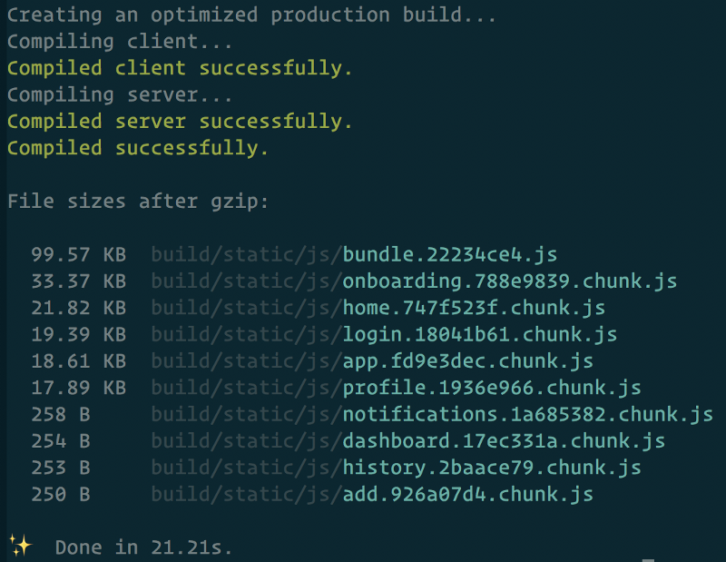
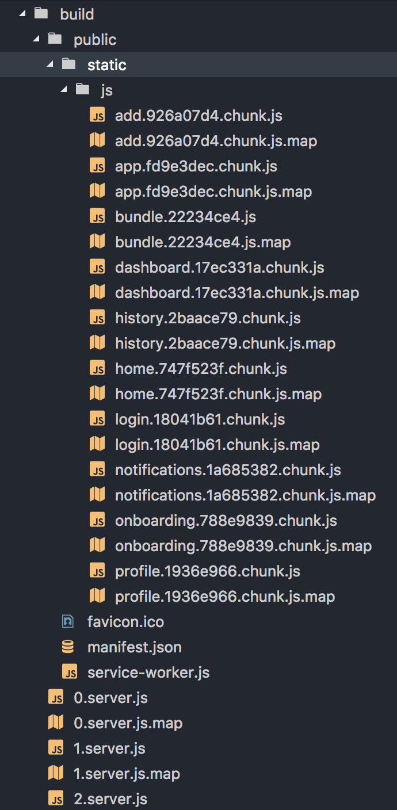
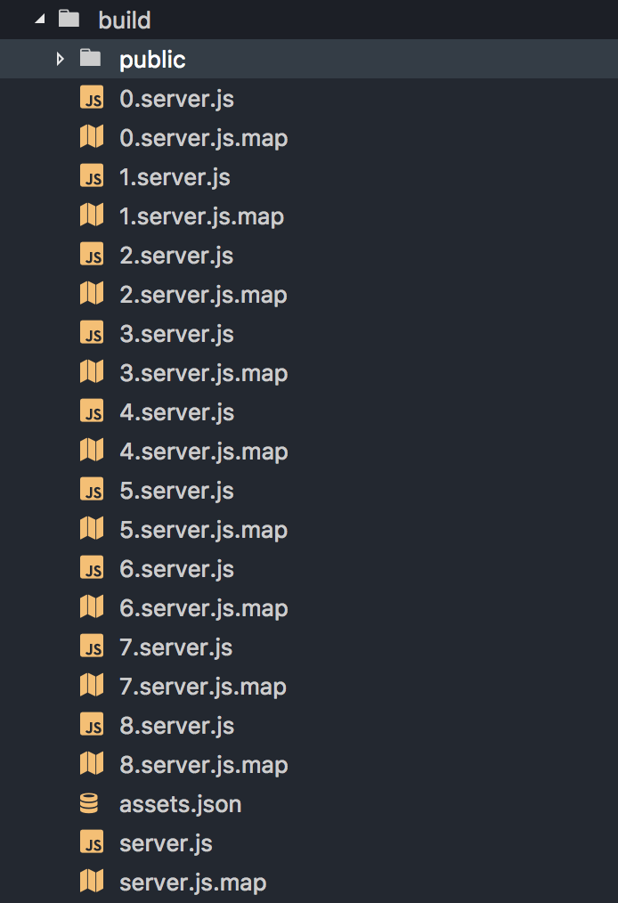
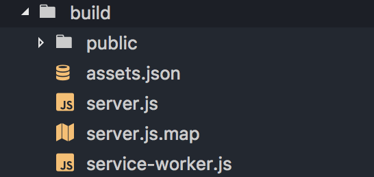

With Code Splitting we are able to reduce kilobytes sent over the wire and potentially improve page speed. Code Splitting is a such an easy-to-use feature that every single page app should consider to add (if haven’t yet).

### So why disable Code Splitting?

Well, of course we shouldn’t!

If you are building server-side rendered apps in React with [Code Splitting](https://webpack.js.org/guides/code-splitting/) support baked in, some might use zero-configuration tools like [Razzle](https://github.com/jaredpalmer/razzle), which runs two webpack instances, one for the client and the other for the server, and it builds everything for the client and for the server for you.

#### So let’s just build some app with Code Splitting!

After defining some major split points in your app, you want to build and see how the chunks are doing so far:



And in the file explorer:



But wait?



#### What is happening here?

Because our app is splitting bundles both on the client and server, multiple bundles are created for the server too, which we don’t really want/need. So we end up having multiple split up _\[number\]_._server.js._ What we want is:

📝 One single server.js.

### Let’s fix it!

One way would be to create another build step to delete all \[number\].server.js, but that would be the last (or not an) option.

A better way would be to tweak the webpack config to _disable Code Splitting for the server_. Doing some research I came across [this gist](https://gist.github.com/jcenturion/892c718abce234243a156255f8f52468) by [@jcenturion86](https://twitter.com/jcenturion86) and learned about [LimitChunkCountPlugin](https://webpack.js.org/plugins/limit-chunk-count-plugin) that allows me to set a limit ofhow many chunks should be created*.* So the config looks like this:

```js
module.exports = {
  plugins: [
    new webpack.optimize.LimitChunkCountPlugin({
      maxChunks: 1,
    }),
  ],
};
```

With this, one single chunk/bundle will be created and voila: Code Splitting is disabled.

So in Razzle, we want to set it only for the server by doing this in the razzle.config.js:

```js
module.exports = {
  module: {
    rules: [
      {
        test: /\.(js|jsx)$/,
        loader: require.resolve('babel-loader'),
        include: ['src'],
        options: {
          presets: [
            'dynamic-import-node',
            'remove-webpack',
          ],
        }
      ],
    },
  },
};
```

Some people encountered type or runtime errors with this approach. So alternatively, we could add these two babel plugins: [babel-plugin-dynamic-import-node](https://github.com/airbnb/babel-plugin-dynamic-import-node) to transpile _import()_ to a deferred _require()_ and then remove webpack features with [babel-plugin-remove-webpack](https://github.com/knpwrs/babel-plugin-remove-webpack):

Both solutions solve the same issue:



✅ One single server.js
